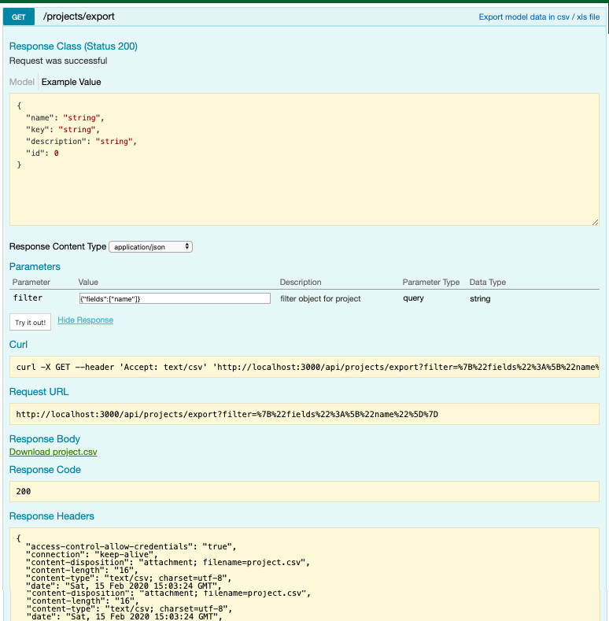

# loopback-import-export-mixin
Loopback mixin for bulk importing and exporting models  
#### Status
Master:[](https://travis-ci.org/go4taj/loopback-import-export-mixin)
Develp:[](https://travis-ci.org/go4taj/loopback-import-export-mixin)
#### Installation:

```bash
npm install --save @tajahmed/loopback-import-export-mixin
```
#### Setup

##### SERVER CONFIG

Add the `mixins` property to your `server/model-config.json`:

```json
{
  "_meta": {
    "sources": [
      "loopback/common/models",
      "loopback/server/models",
      "../common/models",
      "./models"
    ],
    "mixins": [
      "loopback/common/mixins",
      "../node_modules/@tajahmed/loopback-import-export-mixin/src",
      "../common/mixins"
    ]
  }
}
```

##### MODEL CONFIG

To use with your Models add the `mixins` attribute to the definition object of your model config.

```json
  {
    "name": "Widget",
    "properties": {
      "name": {
        "type": "string"
      }
    },
    "mixins": {
      "ImportExport" : {"export": true}
    }
  }
```



##### LICENSE
[Apache License](./LICENSE)
